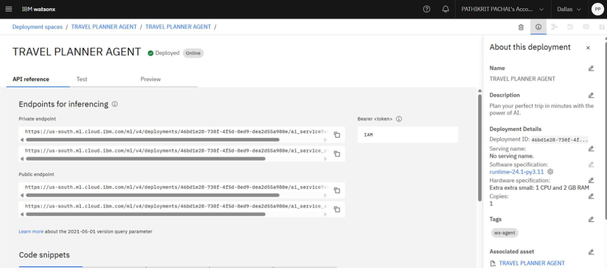
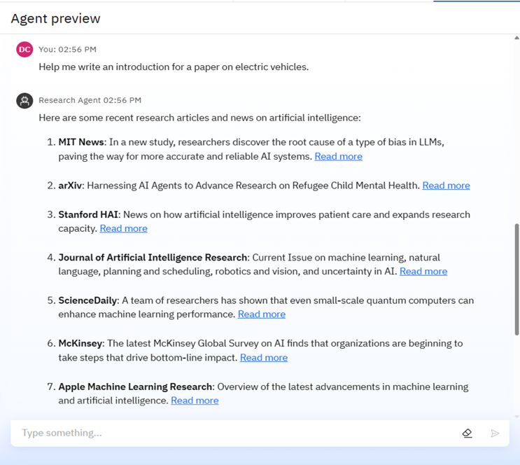
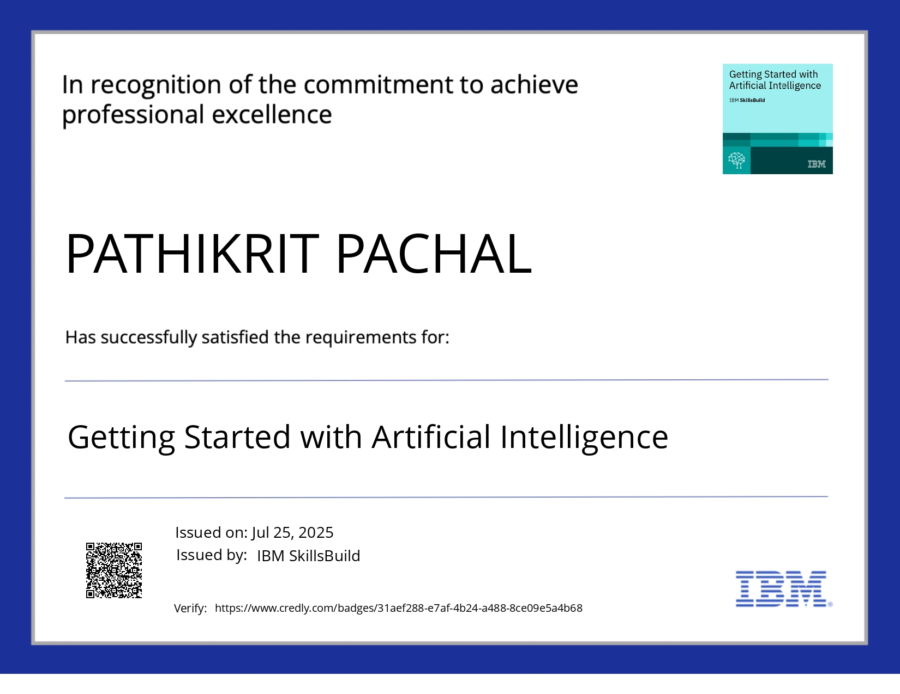
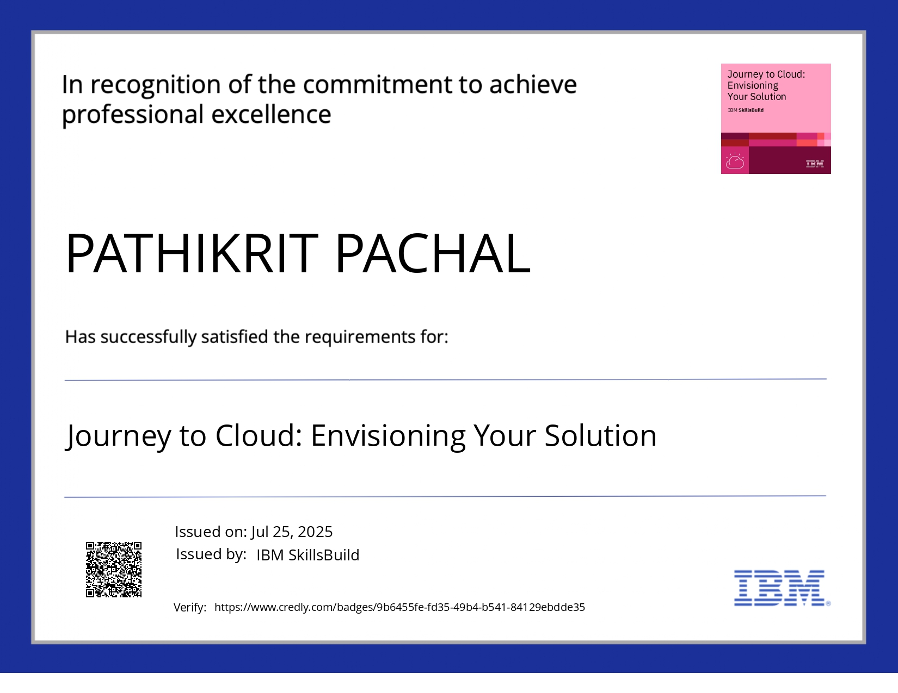
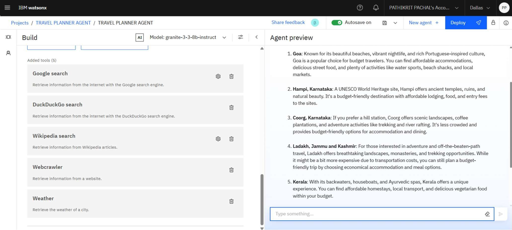
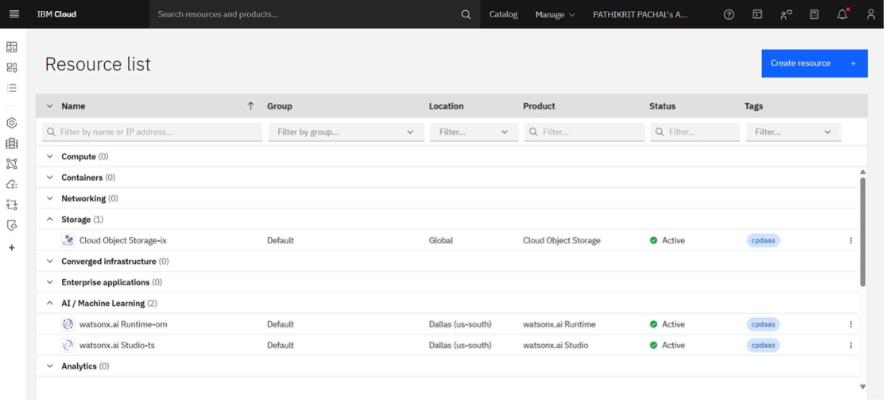
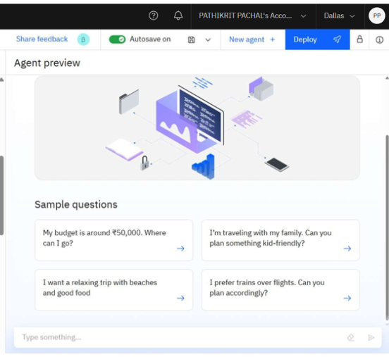
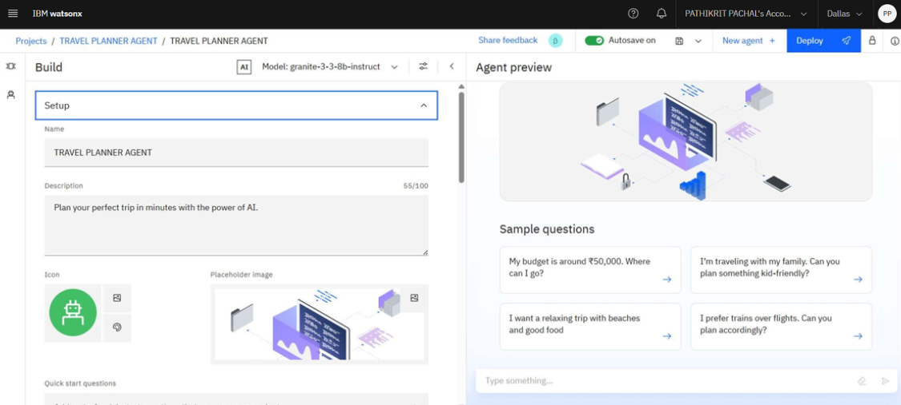

# TRAVEL-PLANNER-AGENT
An intelligent, AI-powered assistant that simplifies trip planning through personalized recommendations, real-time itinerary updates, and natural language interaction.

# 🌍 SMART-AI-TRAVEL-PLANNER-IBM-CLOUD

An intelligent travel assistant powered by AI that simplifies and personalizes trip planning using IBM Cloud Lite and IBM Granite. It provides smart recommendations for destinations, crafts tailored itineraries, and offers the best transport and accommodation choices based on a user's preferences, budget, and travel needs.

<!-- 🖼 Replace below image with your project banner -->

---

## 🔎 PROJECT OVERVIEW

Develop a smart AI Travel Planning Agent capable of:
- Designing trips based on individual choices  
- Offering destination ideas and creating itineraries  
- Suggesting transportation and lodging options  
- Using live data like weather, maps, and events  
- Handling bookings and providing timely notifications  
- Dynamically updating plans for optimal scheduling  

---

## 🧪 TECHNOLOGIES IMPLEMENTED

- IBM Cloud Lite platform  
- Natural Language Processing (NLP)  
- Large Language Models (LLMs)  
- IBM Granite AI  
- IBM App Connect services  

---

## ☁ IBM CLOUD COMPONENTS

- Watsonx.ai Studio on IBM Cloud  
- Watsonx.ai Runtime  
- IBM Cloud Functions for logic processing  
- Cloud Object Storage  
- Watson Assistant  
- IBM Granite through Watsonx Studio  
- IBM’s AI and integration tools  

---

## 💡 HIGHLIGHTED FEATURES

Standout capabilities include:
- Adjusts travel plans in real time based on live weather and delay alerts  
- Understands user requests via IBM Granite's NLP engine  
- Offers plans tailored to personal interests, financial limits, and travel duration  
- Seamlessly integrates maps, weather, and third-party booking info  
- Chat-based interface powered by Watson Assistant for easy interaction  
- Uses IBM Cloud Functions for backend automation without server management  

---

## 🧍 TARGET USERS

- Solo tourists and group travelers  
- Content creators and travel bloggers  
- Tour operators and travel agencies  
- Business professionals on corporate trips  
- Students and academic travelers  

---

## 🌐 API ENDPOINT PREVIEW

<!-- 🖼 Replace with your own screenshot -->

---

## 🚀 LIVE DEMO & DEPLOYMENT VIEW

<!-- 🖼 Replace with your own screenshot -->

---

## 📊 OUTPUT & PERFORMANCE

<!-- 🖼 Replace with your own screenshot -->

---

## 🧾 FINAL THOUGHTS

- Greatly reduces the hassle of planning trips manually  
- Delivers adaptive, user-centric travel solutions in real-time  
- A practical example of AI solving real-world planning and logistics tasks  

---

## 🔗 PROJECT REPO

[Access GitHub Repository](https://github.com/Pathikrit007/TRAVEL-PLANNER-AGENT.git)

---

## 🚧 FUTURE IMPROVEMENTS

- Integration with voice assistants like Alexa and Siri  
- Multi-language support using Watson services  
- API hookups with flight/hotel platforms  
- Real-time emergency help based on user location  
- Offline access for remote travel scenarios  
- AR previews of destinations  
- Budget-optimizing AI to match user constraints  
- Social sharing and community suggestions  

---

## 📜 IBM CERTIFICATIONS

<!-- 🖼 Replace certificate images if needed -->
### Introduction to AI Certificate  

### Cloud Fundamentals Certificate  

---

---

## 📚 SUPPORTING MATERIALS

<!-- 🖼 Replace with your own screenshot -->

---

## 🧰 DEVELOPMENT TOOLS

<!-- 🖼 Replace with your own screenshot -->

---

## ❓ COMMON QUERIES

<!-- 🖼 Replace with your own screenshot -->

---

## 🧾 AGENT SETUP GUIDE

<!-- 🖼 Replace with your own screenshot -->

---

---

## 🙌 APPRECIATION

Thanks for checking out the project! Your support and feedback are welcome.
